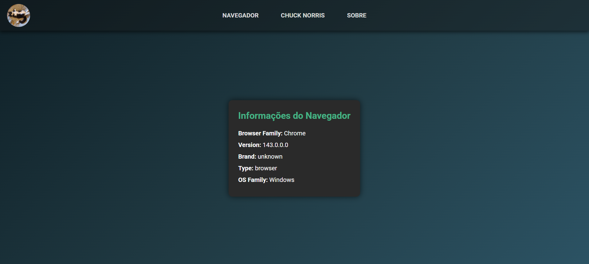
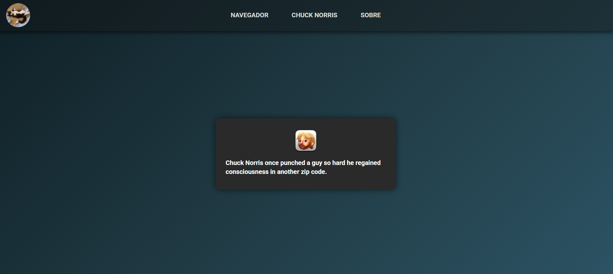

# Projeto de Consumo de APIs públicas (React Chuck Norris)🤠

Aplicação web desenvolvida com React e Vite como atividade prática da disciplina de Frontend Frameworks da UNINASSAU.
O projeto tem como objetivo o consumo de múltiplas APIs públicas, organização de componentes, navegação entre telas
e aplicação de boas práticas básicas de desenvolvimento frontend.

---

## 📌 Funcionalidades

- Exibição de um avatar dinâmico de gato no menu superior
- Consulta e exibição de informações do navegador do usuário
- Exibição de frases aleatórias do Chuck Norris
- Navegação entre telas utilizando React Router
- Tela "Sobre" com informações do desenvolvedor
- Interface responsiva e estilizada com CSS

---

## 🌐 APIs Públicas Utilizadas

- **Cataas (Avatar de Gato)**  
  https://cataas.com/cat

- **CAgent (Informações do Navegador)**  
  https://www.apicagent.com

- **Chuck Norris API (Frases Aleatórias)**  
  https://api.chucknorris.io/jokes/random

---

## 🛠️ Tecnologias Utilizadas

- React
- Vite
- JavaScript
- HTML5
- CSS3
- React Router DOM
- React Icons
- Node.js

---

## ▶️ Como executar o projeto:

### Pré-requisitos

- Node.js versão 20.19.\*
- Git instalado

### Passo-a-Passo:

```bash
# Clone o repositório
git clone https://github.com/AlexandrePaschoal/react_chucknorris

# Acesse a pasta do projeto
cd react_chucknorris

# Instale as dependências
npm install

# Execute a aplicação
npm run dev

# OBS: Caso queria ter acesso ao código-fonte, digitar o comando abaixo
code .

```

## 📸 Prints da aplicação

- `Navegador`




- `Chuck Norris`




- `Sobre`


